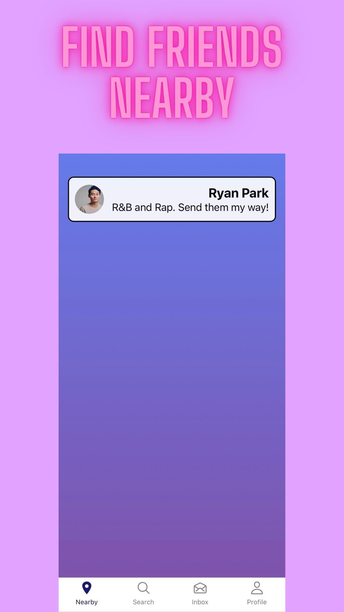
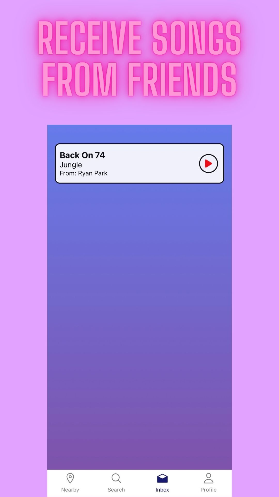
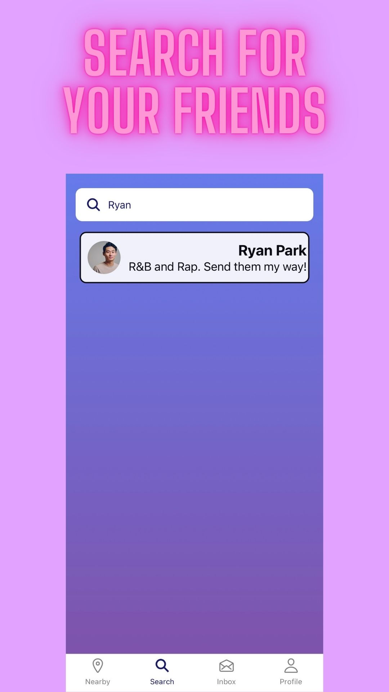
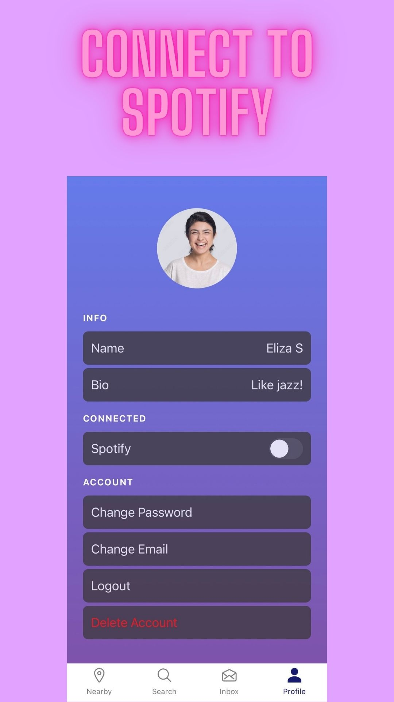

# SongMS
React Native Expo app to send and receive songs (basic info like song name, artist, Spotify and YouTube links). Express.js backend connected to Firebase. Nearby users detection using location tracking, geohashing, and sockets (for real time updates).


## To Run
### Frontend
- iOS: ```npx expo start``` and preview on Expo mobile app
### Backend
- Need Firebase credentials as env vars
- ```node app.js```

## Future Improvements
- push notifications

## Preview 
<div>
  
  
  
  
</div>

